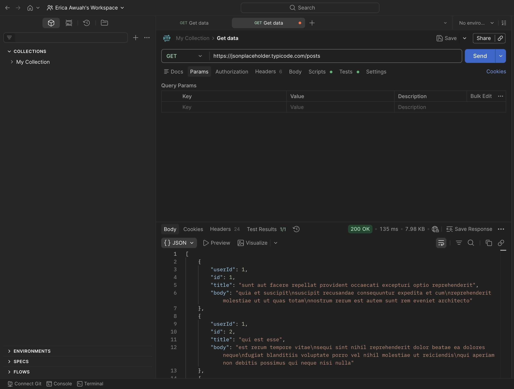
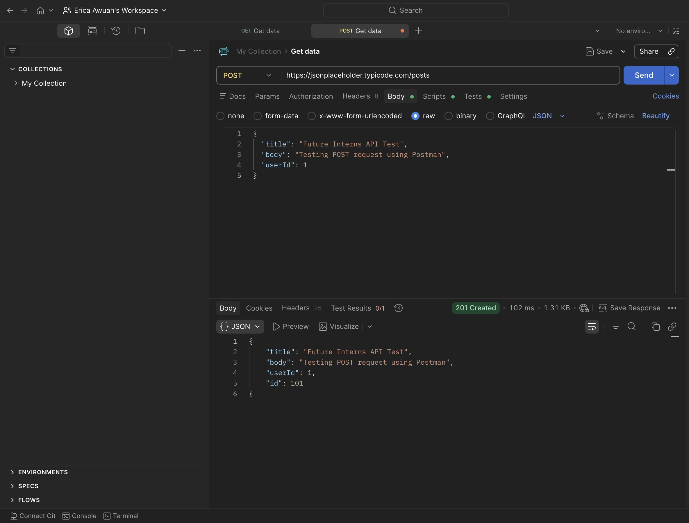

# API Testing with Postman

This project demonstrates basic API testing using Postman.

## GET Request Test
A GET request was sent to the following API endpoint:

https://jsonplaceholder.typicode.com/posts

The server returned a **200 OK** response with JSON data containing sample posts.

### GET Request Screenshot

---

## POST Request Test
A POST request was sent to the following API endpoint:

https://jsonplaceholder.typicode.com/posts

A JSON body was submitted containing:
- title
- body
- userId

The server returned a **201 Created** response confirming the new resource was created.

### POST Request Screenshot

---

## Tools Used
- Postman
- GitHub
- JSONPlaceholder API
